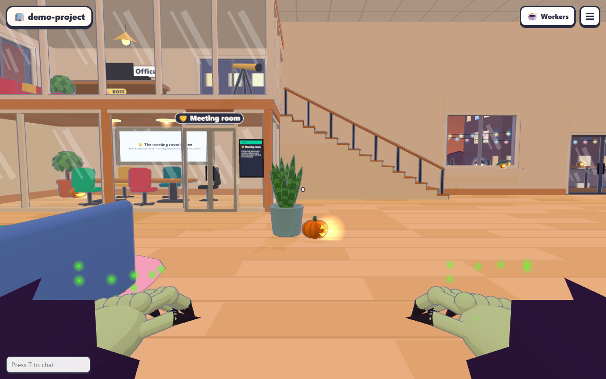
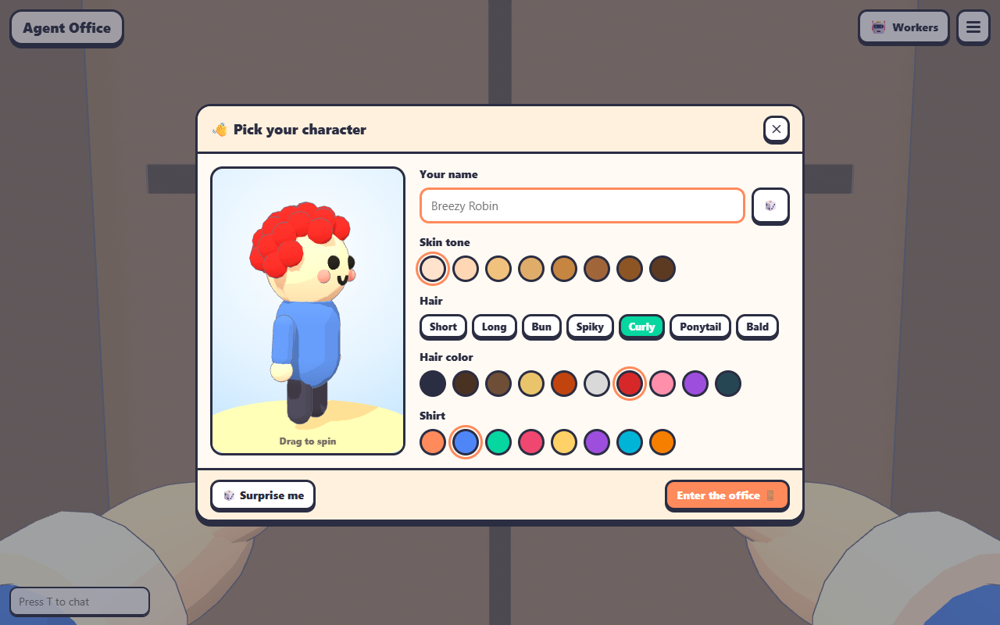
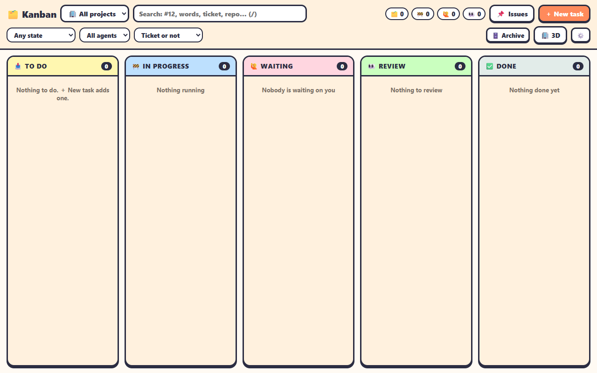
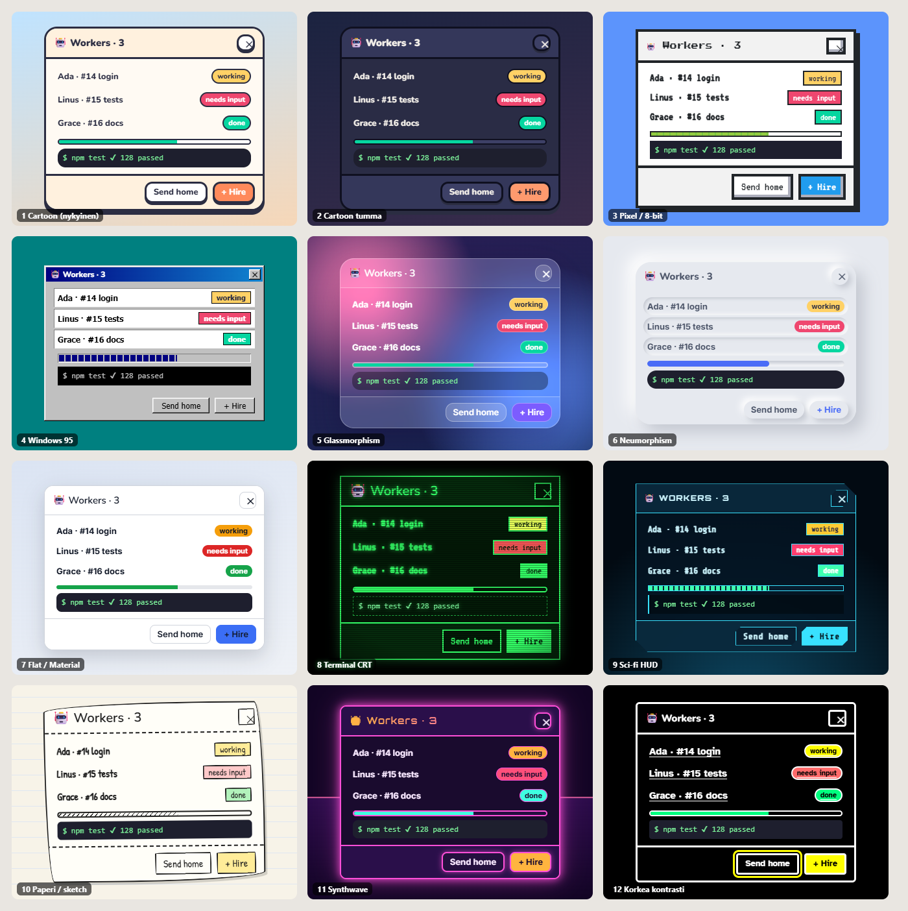
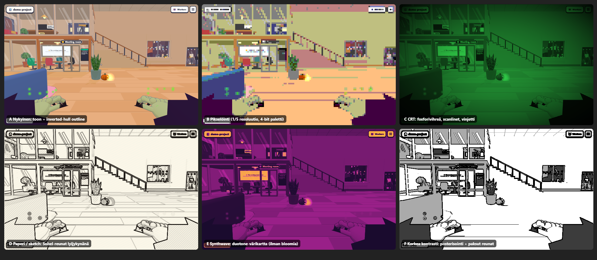

# Visuaaliset tyylit ja teemat: selvitys

Takaisin [README:hen](../../README.md). Tämä on suunnitteludokumentti: se ei muuta koodia. Siinä kuvataan
nykytila, vaihtoehtoiset tyylit ikkunoille, HUDille ja 3D-maailmalle, teemanvaihdon mekanismi,
kirjastot sekä toteutusjärjestys pieninä kanban-tehtävinä. Selvitys on tehty 2026-10-01 commitin
`4b812ae` päällä. Kirjastojen versiot ja lisenssit on tarkistettu samana päivänä npm:stä, GitHubista
ja kirjastojen omilta sivuilta, ja lähteet ovat [lopussa](#lähteet).

## Tiivistelmä

- **Värit ja muodot ovat nyt kovakoodattuja.** `style.css`:n `:root`issa on 13 CSS-muuttujaa
  (`--ink`, `--paper`, `--accent` …), ja niitä käytetäänkin paljon (`var(--ink)` ~350 kertaa). Silti
  CSS-tiedostoissa on lisäksi **~400 kovakoodattua hex-väriä** (126 eri arvoa). Reunat, pyöristykset,
  varjot ja fontit on kirjoitettu suoraan sääntöihin. TypeScriptissä on vielä ~100 hex-väriä
  (UI-koodi, canvas-piirto) ja 3D-maailmassa ~1 240. Kaikki tämä pitää kerätä yhteen ennen kuin
  teemoja voi vaihtaa.
- **Suositus teemamekanismiksi:**
  - kolmitasoiset design tokenit CSS-muuttujina (primitiivit → semanttiset → komponenttitokenit)
  - `data-theme`-attribuutti `<html>`-elementissä
  - teema käyttäjän asetuksena (`Settings.theme` samassa `agent-office.settings`-localStorage-avaimessa
    kuin hiiren herkkyys), jolloin 3D-toimisto, `/lite` ja `/kanban` seuraavat samaa teemaa
  - xterm-, Excalidraw- ja 3D-teemat johdetaan samasta teemaobjektista
  - ei UI-kehystä: Tailwindia, Picoa ja muita reset-kirjastoja ei oteta käyttöön
- **Ensimmäiset tyylit:** *Cartoon tumma* ja *Korkea kontrasti*. Molemmat ovat pelkkiä tokenivaihtoja,
  ja ne todistavat, että mekanismi toimii. Seuraavaksi kannattaa tehdä yksi vahvasti erottuva tyyli,
  joka ulottuu 3D:hen asti: *Terminal CRT* tai *Pixel*. *Paperi/sketch* sopii Excalidraw-taulun takia
  luontevasti kolmanneksi.
- **Ihmisen päätettävä asia:** upstreamin `style.css` (1 302 riviä, 241 hex-väriä). Sen
  tokenisointi on iso muutos upstream-tiedostoon, ja AGENTS.md sallii upstream-tiedostoihin vain
  pieniä saumoja. Suositus on tarjota tokenisointi ensin upstreamiin PR:nä. Jos upstream ei ota sitä
  vastaan, fork tekee teemat päällekirjoituskerroksena (ks. [T1](#ehdotettu-toteutusjärjestys)).

## Nykytila

| Nykyinen 3D-toimisto ja HUD | Modaali (`openModal`, ✕ oikeassa yläkulmassa) | Kanban (`/kanban`) |
|---|---|---|
|  |  |  |

Kuvat on otettu headless-Chromella dev-palvelimesta (1280×800), tyhjällä demoprojektilla.

### CSS

Kaikki tyylit on kirjoitettu käsin, ilman esikääntäjää tai kehystä. Viite: `src/client/style.css:3`.

| Tiedosto | Rivejä | hex-värejä (eri) | `rgba()` | `Npx solid` -reunoja | `border-radius: Npx` | `box-shadow` | `var(--…)` |
|---|---:|---:|---:|---:|---:|---:|---:|
| `style.css` (upstream) | 1302 | 241 (77) | 49 | 150 | 158 | 52 | 424 |
| `lite.css` (upstream) | 76 | 8 (5) | 0 | 4 | 2 | 5 | 18 |
| `login.css` (upstream, omat muuttujat) | 30 | 14 (10) | 0 | 5 | 6 | 4 | 14 |
| `kanban/kanban.css` (fork) | 214 | 57 (32) | 4 | 24 | 24 | 10 | 59 |
| `kanban/taskview.css` (fork) | 177 | 53 (22) | 3 | 30 | 31 | 3 | 52 |
| `kanban/settings.css` (fork) | 92 | 20 (12) | 1 | 12 | 13 | 1 | 25 |
| `kanban/changesview.css` (fork) | 49 | 4 (1) | 1 | 6 | 2 | 1 | 12 |
| `kanban/officecss.ts` (fork, CSS merkkijonona) | – | ~15 | – | – | – | – | – |

**Muuttujat** (`style.css:3–17`) ovat `--ink`, `--paper`, `--paper-2`, `--accent`, `--accent-ink`,
`--muted`, `--good`, `--warn`, `--bad`, `--info`, `--shadow`, `--radius` ja `--font`. Niitä
käytetään paljon: `--ink` 346, `--muted` 162 ja `--paper-2` 63 kertaa. Rakenteen muuttujat ovat
kuitenkin lähes käyttämättä. `--radius` esiintyy 4 kertaa, vaikka kovakoodattuja pyöristyksiä on
158 (999px ×42, 10px ×40, 12px ×39, 14px ×25 …). `--shadow` esiintyy 6 kertaa, vaikka `0 Npx 0
var(--ink)` -varjoja on kymmeniä. `--accent-ink` on määritelty mutta käyttämättä.

**Yleisimmät kovakoodatut värit:**

- `#fff` 142 kertaa (painikkeiden, syötekenttien ja korttien pinta)
- pastellit: `#ffd6e0` ×14, `#fff3c4` ×11, `#e0f2fe` ×10, `#d8f5e3` ×10, `#caffbf` ×8
- tekstivärit: `#1d6fd6`, `#c9184a`, `#2a9d4b`, `#c3423f`
- terminaalin tausta `#1e1f2e`
- taivas `#bfe3ff` (myös `html`:n tausta)

**Rakenteen merkit** toistuvat käsin kirjoitettuina: `3px solid var(--ink)` 65 kertaa,
`border: 2px` 68 kertaa ja `border: 3px` 52 kertaa. Ne ovat nykyisen cartoon-ilmeen tuntomerkit
(paksu musteraja ja kova pudotusvarjo `0 3px 0 var(--ink)`). Ne pitäisi saada tokeneiksi
(`--border-w`, `--shadow-sm`), jotta esimerkiksi flat- tai glass-tyyli voisi poistaa ne.

**`login.css` on erillinen saareke.** Sillä on omat muuttujansa (`--bg`, `--card`, `--border`)
eikä se tuo `style.css`:ää. `public/offline.html` on myös erillinen.

**Kanbanin tyylit ovat kahdessa paikassa.** `kanban.css` tuo `style.css`:n (`@import '../style.css'`).
3D-toimistossa ja `/lite`-näkymässä kanbanin palat saavat tyylinsä `officecss.ts`:stä, joka
injektoi merkkijonon `<style>`-elementtiin.

### TypeScript (DOM, canvas, 3D)

- **Modaalit:** `ui/dom.ts:openModal()` luo modaalin. Se lisää `.backdrop`-elementin `#modal-root`iin,
  käsittelee Escin, lisää ✕:n (`addCloseButton()` → `button.btn.close`, joko otsikon perään tai
  `.corner`-luokalla oikeaan yläkulmaan) ja ilmoittaa `onModalChange`-kuuntelijoille, joiden kautta
  mouse-look palaa. Ulkoasu on täysin CSS:n varassa (`.modal`, `.modal header`, `.modal footer`,
  `style.css:301–309`). **Tämä on teemoituksen kannalta hyvä uutinen:** mikään teema ei tarvitse
  muutoksia modaalilogiikkaan, ja ✕- ja Esc-sääntö säilyy automaattisesti.
- **Inline-tyylit:** `h()`-apufunktio ottaa `style`-merkkijonon. Inline-`style` on ~30 paikassa
  `ui/`- ja `kanban/`-hakemistoissa, ja siellä on ~100 hex-väriä. Suurin osa on dataa, kuten
  pelaajan väri (`hud.ts`: `background:${p.color}`) tai merkkien värit, eikä teeman asia. Seassa on
  kuitenkin myös teemaan kuuluvia värejä.
- **Terminaali:** `ui/termtheme.ts` on yksi kiinteä `TERM_THEME`-objekti (Dracula-henkinen tumma).
  Sitä käyttävät `ui/terminal.ts:148` (`theme: TERM_THEME` sekä hakuosuman korostuksen värit) ja
  `world/laptop.ts`, joka piirtää työpöytien läppäreiden näytöt canvasiin samoilla 16 ANSI-värillä.
- **Fontit:** `--font` on `'Nunito', ui-rounded, …`, mutta **Nunitoa ei ladata mistään**. Repossa
  ei ole `@font-face`-määrittelyä, woff2-tiedostoa eikä Google Fonts -linkkiä. Käytännössä fontti
  on käyttäjän järjestelmäfontti (Windowsissa Segoe UI, kuten kuvakaappauksista näkyy), ellei
  Nunitoa ole asennettu koneelle. Lisäksi:
  - `login.css`:n `button` ei peri fonttia, joten *Come on in* piirtyy selaimen oletusfontilla.
  - Canvas-piirroissa fontti on kovakoodattu: `world/toon.ts:textTexture()`, `ui/blocks.ts`,
    `ui/minesweeper.ts`, `world/bargames.ts` ja `main.ts:331`. Yhteensä ~95 `ctx.font =` -riviä.
- **Asetukset:** `state.ts:Settings` tallennetaan localStorageen avaimella `agent-office.settings`.
  Fork lisäsi sinne jo `mouseSensitivity`-kentän ja *🧍 You* -paneeliin liukusäätimen
  (`docs/fork.md`, rivit `settings.ts` / `state.ts` / `main.ts`). **Sama kaava sopii teemalle
  sellaisenaan.**
- **Saavutettavuus:** käytössä on jo `prefers-reduced-motion` (6 kohtaa) ja `:focus-visible`.
  `prefers-color-scheme`-, `prefers-contrast`- ja `forced-colors`-tukea ei ole. `<meta
  name="theme-color" content="#fff1de">` on kiinteä `index.html`:ssä, `claim.html`:ssä ja
  `join.html`:ssä.

### 3D

- `main.ts:138–143`:
  - `WebGLRenderer` asetuksilla `antialias: true` ja `powerPreference: 'high-performance'`
  - pikselitiheys enintään 2
  - PCF-varjot (aurinko 2048²)
  - `SRGBColorSpace`
  - **`OutlineEffect`** (three/examples, inverted hull), parametrit `defaultThickness: 0.0032` ja
    `defaultColor: [0.17, 0.18, 0.26]` (= `--ink`)
- `world/toon.ts`:
  - `toon(color)` palauttaa välimuistista `MeshToonMaterial`in, jolla on 3-portainen `gradientMap`
    (90/185/255, `NearestFilter`)
  - `textTexture()` piirtää nimilaput canvasiin Nunitolla ja `#2b2d42`-reunalla
  - Ohuet ja läpinäkyvät esineet pois jätetään ääriviivoista `userData.outlineParameters =
    { visible: false }` -asetuksella.
- `world/sky.ts` (1 076 riviä) vaihtaa taustan, sumun, auringon ja valot vuorokaudenajan ja sään
  mukaan. Teeman 3D-värien on toimittava yhdessä tämän kanssa, ei sitä vastaan.
- `framerate.ts:SlowFrames` tarjoaa `/lite`-näkymää, jos ruutu kestää keskimäärin ≥ 50 ms
  10 sekunnin ajan. Jokainen jälkikäsittelypassi syö samaa budjettia.
- Excalidraw-taulu (`ui/whiteboard-app.ts:284`) on kiinteästi `theme: 'light'`.

### Ongelmat teemoitettavuudelle

1. **Rakenne ei ole tokeneissa.** Värimuuttujat on, mutta reunan paksuus, pyöristys, varjo ja fontti
   on kovakoodattu ~400 kohtaan. Pelkillä värimuuttujilla saa vain *Cartoon tumman*; kaikki muut
   tyylit vaativat rakennetokenit.
2. **Semanttiset nimet puuttuvat.** `#fff` tarkoittaa milloin painikkeen pintaa, milloin
   syötekenttää ja milloin korttia. Pastellit (`#ffd6e0` = "huomio", `#d8f5e3` = "valmis") ovat
   tilavärejä ilman nimeä. Tummassa teemassa jokainen niistä pitää kääntää erikseen.
3. **Paras tiedosto teemoittaa on upstreamin.** `style.css`:n muuttaminen on forkin sync-politiikan
   vastaista, kun muutos on näin laaja (ks. [Fork-saumat](#fork-saumat)).
4. **Tyylit ovat kolmessa erillisessä kopiossa.** `login.css`, `offline.html` ja `officecss.ts`
   ovat omia saarekkeitaan.
5. **Canvas ja 3D lukevat värit ja fontit TS-vakioista**, eivät CSS:stä: `TERM_THEME`, `ctx.font`,
   `toon(color)`, `textTexture()`. Ne tarvitsevat teemaobjektin, josta lukea, ja tiedon siitä, milloin
   teema vaihtuu.
6. **Fontti puuttuu.** Nunitoa ei ladata, joten nykyinen ilme riippuu käyttäjän koneesta. Tämä
   kannattaa korjata joka tapauksessa (ks. [T0](#ehdotettu-toteutusjärjestys)).
7. **Ikoneina ovat emojit.** Kaikki painikkeiden ikonit (🤖, 📋, ⚙️, ✕ …) ovat emojeja. Ne näyttävät
   eri käyttöjärjestelmissä erilaisilta, eikä niitä voi teemoittaa: emoji ei sovi pixel- tai
   CRT-tyyliin. Ikonipaketin vaihto on iso, erillinen työ (ks. [Kirjastot](#kirjastot)).

## Tyylivaihtoehdot

Alla 11 vaihtoehtoa ja nykyinen. Mockup-kuvassa sama Workers-modaali (otsikko + ✕, rivit tilapilleillä,
mittari, terminaalirivi, painikkeet) on piirretty jokaisella tyylillä. Jokainen tyyli on tehty
**vain tokeneita vaihtamalla** sekä muutamalla tyylikohtaisella säännöllä, eli juuri suositellulla
mekanismilla. Kuvat ovat staattisia HTML/CSS-luonnoksia, eivät sovelluksen koodia.



3D-maailman tunnelmakuvat on tehty **likimääräisesti**: nykyisestä kuvakaappauksesta on käsitelty
2D-canvas-suodattimilla pikselöity, CRT-, sketch-, synthwave- ja korkean kontrastin versio.
HUD suodattui kuvaan mukana, mutta oikeassa toteutuksessa se ei suodattuisi. Kuva näyttää
suunnan, ei shaderin lopputulosta.



Työmäärä: **S** = tokenivaihto, alle päivä. **M** = tokenit, tyylikohtaista CSS:ää ja fontti, 1–3
päivää. **L** = lisäksi 3D-shaderit tai jälkikäsittely ja oma testaus, yli viikko. Arviot olettavat,
että tokenit ([T1](#ehdotettu-toteutusjärjestys)) ja teema-asetus (T2) ovat jo valmiina.

### 1. Cartoon (nykyinen, oletus)

- **Kuvaus:** paksu musteraja, kova pudotusvarjo, pastellit, pyöreä fontti, toon-materiaali ja
  inverted hull -ääriviiva.
- **Sopivuus:** paras. Ilme on yhtenäinen 3D-maailman kanssa ja upstreamin tuntomerkki.
- **Työ:** 0 (pysyy oletuksena). Nunito pitää kuitenkin ladata oikeasti (T0).
- **Riskit:** ei riskejä. Kaikki muut teemat ovat poikkeamia tästä.

### 2. Cartoon tumma

- **Kuvaus:** sama muoto, mutta pinnat ovat tummaa violetinsinistä (`#2a2c45`), mustetta on vielä
  tummempi (`#0f1020`) ja tekstit vaaleat. Aksentti kirkastuu hieman, jotta kontrasti säilyy.
  3D-puolella yötaivas ja lamput ovat jo olemassa (`sky.ts`). Teema voi pyytää "ilta"-valaistusta
  tai jättää maailman ennalleen.
- **Sopivuus:** erittäin hyvä. Monet kehittäjät haluavat tumman UI:n, ja terminaali on jo tumma.
  Voi seurata `prefers-color-scheme`-asetusta (*Auto*).
- **Työ:** S (UI), M (jos 3D-valaistus seuraa).
- **Riskit:** jokainen ~126 kovakoodatusta väristä on käännettävä. Ilman T1:tä tulee "valkoisia
  saarekkeita". Pastellitilavärit tarvitsevat tummat parit (WCAG 1.4.3: 4,5:1 tekstille).

### 3. Pixel art / retro 8-bit

- **Kuvaus:**
  - UI: suorat kulmat (`--radius: 0`), 4 px reunat, porrastetut "pikselivarjot", Press Start 2P
    otsikoissa ja VT323 tai Silkscreen leipätekstissä. NES.css on hyvä mallikuva.
  - 3D: pikselöinti, eli renderöinti 1/3–1/5 resoluutiolla ja `NearestFilter`-skaalaus ylös, sekä
    rajattu paletti (posterisointi). Lisäksi `RenderPixelatedPass`in normaali- ja syvyysreunat
    korvaavat inverted hullin. Toon-ramppi 2-portaiseksi.
- **Sopivuus:** hyvä. Toimisto on jo peli (minesweeper, arcade, tikkataulu), ja pixel-ilme sopii
  siihen luontevasti.
- **Työ:** M (UI), L (3D-pikselöinti, HUD-tekstien luettavuus, nimilappujen fontit canvasissa).
- **Riskit:**
  - Press Start 2P on luettava vain isona, joten se sopii vain otsikoihin.
  - Emojit rikkovat ilmeen; tarvitaan Pixelarticons tai jokin muu pikseli-ikonisto.
  - Pikselöinti piilottaa pienen tekstin 3D:ssä (desk-kyltit, taulut). Taulut ja läppärit pitää
    joko jättää passin ulkopuolelle (erillinen render layer) tai hyväksyä tämä.
  - Suorituskyky voi jopa parantua, koska täysi resoluutio renderöidään harvemmin.

### 4. Windows 95 / vaporwave

- **Kuvaus:** harmaa `#c0c0c0`, viistetyt 3D-reunat (`inset`-varjot), sininen liukuväriotsikko ja
  pieni ✕-painike otsikkopalkissa, Tahoma tai pikseli-MS Sans Serif. Vaporwave-variantissa
  taustaksi turkoosi tai pinkki liukuväri, kreikkalaiset patsaat ja ruudukkolattia.
  - 98.css antaa ulkoasun valmiina.
  - 7.css:llä on valmis *scoped*-versio (`.win7`).
  - 3D-puolella riittää *dithering* (ColorDepth-efekti) ja ehkä sävytetty väritaulukko (LUT).
- **Sopivuus:** kohtalainen. Huumorina ja nostalgiana hauska, ja sopii toimistoteemaan ("työpöytä").
  Pitkäaikaiseen käyttöön ilme on raskas.
- **Työ:** M. 98.css hoitaa paljon, mutta se on rajattava ([kirjastot](#kirjastot)).
- **Riskit:**
  - 98.css tyylittää paljaat `button`- ja `input`-elementit globaalisti, joten se on pakko eristää
    `@layer`- tai `@scope`-säännöllä.
  - Pieni fontti (11–12 px) on huono saavutettavuudelle.
  - Microsoftin logoja tai tavaramerkkejä ei saa käyttää. Pelkkä ulkoasu on yleisesti jäljitelty
    (98.css on MIT).

### 5. Glassmorphism

- **Kuvaus:** puoliläpinäkyvät paneelit `backdrop-filter: blur()` -sumennuksella, ohut vaalea reuna,
  pehmeä iso varjo, Inter. Sopii erityisen hyvin HUDiin, koska 3D-maailma näkyy paneelien läpi
  sumennettuna. 3D-puolelle ei tarvita muutoksia; kevyt bloom voi korostaa.
- **Sopivuus:** hyvä HUDille ja kohtalainen modaaleille. Modaalin takana on taustakerros
  (`.backdrop` 45 % musta), ja sen pitää olla kevyempi, jotta lasi näkyy.
- **Työ:** S–M.
- **Riskit:**
  - Suorituskyky: `backdrop-filter` WebGL-canvaksen päällä pakottaa selaimen kompositoimaan
    sumennuksen joka ruudulla. Monta paneelia ja iso säde näkyvät heikoilla koneilla.
  - Kontrasti vaihtelee taustan mukana. Kirkkaalla taivaalla valkoinen teksti ei läpäise WCAG:tä,
    joten tarvitaan tumma "lasi" tai tekstivarjo.
  - `prefers-reduced-transparency` on vasta osittain tuettu, joten `prefers-contrast: more`
    -tilassa lasi on korvattava umpinaisella pinnalla.

### 6. Neumorphism (soft UI)

- **Kuvaus:** pinta ja tausta ovat samaa väriä, ja muodot syntyvät kahdesta varjosta (vaalea ja
  tumma). Ei reunoja.
- **Sopivuus:** huono. Mockupissa ✕ ja toissijaiset painikkeet katoavat lähes kokonaan.
- **Työ:** S.
- **Riskit:** WCAG 1.4.11 (ei-tekstuaalinen kontrasti 3:1) ei täyty käytännössä koskaan:
  painikkeen raja on vain varjo. Lisäksi tila (painettu tai ei) näkyy huonosti. **Ei suositella**,
  paitsi ehkä yhden korostetyylin inspiraationa.

### 7. Minimalistinen flat / Material

- **Kuvaus:** valkoinen pinta, 1 px harmaa reuna, pehmeä varjo, 8–14 px pyöristys, Inter, kylläiset
  tilavärit, ikonit Lucidelta tai Tabler Iconsilta. 3D-puolella ääriviiva ohennetaan tai poistetaan
  ja toon-ramppi korvataan pehmeämmällä (5 askelta tai `MeshLambertMaterial`).
- **Sopivuus:** hyvä "työtilaksi", kun käyttäjä haluaa kanbanin ja terminaalit, ei peliä. Sopii
  kanban-näkymään jopa paremmin kuin cartoon.
- **Työ:** M. Tämä on ainoa tyyli, jossa ikonipaketin vaihtamisella on oikeasti väliä.
- **Riskit:** geneerisyys, koska toimiston persoonallisuus katoaa. 3D:n ja UI:n välille syntyy
  ristiriita, jos maailma jää cartooniksi.

### 8. Terminal / hacker CRT

- **Kuvaus:**
  - UI: musta tai tumma fosforinvihreä tausta, vihreä (tai meripihkan) teksti `text-shadow`-hehkulla,
    VT323 tai IBM Plex Mono, ei pyöristyksiä, katkoviivareunat ja ASCII-kehykset.
  - 3D: CRT-jälkikäsittely, eli scanlinet, kevyt tynnyrivääristymä, vinjetti, kromaattinen aberraatio,
    kohina ja yksivärinen väritaulukko.
  - xterm-teema on luonnostaan sama, ja tämä on ainoa tyyli, jossa terminaali ja UI ovat täysin yhtä.
- **Sopivuus:** erittäin hyvä kohderyhmälle, eli koodiagenttien toimistolle. Vahva identiteetti.
- **Työ:** M (UI), L (3D-CRT ja yksivärinen maailma).
- **Riskit:**
  - Yksivärisyys hävittää tilavärien merkityksen (punainen *needs input*), joten tila on
    näytettävä myös muodolla tai tekstillä.
  - Hehku ja vääristymä väsyttävät, joten ne pois `prefers-reduced-motion`- ja
    `prefers-contrast`-tiloissa.
  - Fullscreen-passit maksavat suorituskykyä (ks. [3D](#3d-renderöintitekniikat)).

### 9. Sci-fi HUD

- **Kuvaus:**
  - UI: tumma läpikuultava pinta, syaanit 1 px viivat ja hehku, viistetyt kulmat (`clip-path`,
    augmented-ui), Orbitron otsikoissa ja Share Tech Mono tai Rajdhani tekstissä, segmenttimittarit.
  - 3D: bloom emissiivisille pinnoille, ohut syaani ääriviiva (Sobel-reunat), ehkä hologrammimainen
    läpinäkyvyys tauluille.
- **Sopivuus:** hyvä HUDille (top bar, dock, sivupaneelit), kohtalainen pitkille teksteille (PR-diffi,
  taskview).
- **Työ:** M (UI), L (3D-bloom ja hehkuvat materiaalit).
- **Riskit:**
  - `clip-path` leikkaa myös `:focus-visible`-outlinen, joten fokusrengas on piirrettävä erikseen.
  - Arwes-kirjasto on hylätty (ks. alla), joten kaikki tehdään itse.
  - Kirkas neon tummalla läpäisee kontrastivaatimuksen, mutta haalea syaani ei.

### 10. Paperi / sketch (Excalidraw-henkinen)

- **Kuvaus:**
  - UI: luonnonvalkoinen tai ruudullinen paperi, 2 px "käsin piirretyt" epäsäännölliset reunat
    (`border-radius: 255px 15px 225px 15px / …` -temppu tai rough.js-SVG), kevyt kallistus, käsin
    kirjoitettu fontti (Excalifont, Patrick Hand tai Kalam), korostusväri kuin korostustussi.
  - 3D: Sobel-reunat lyijykynänä, varjostus viivoituksena (*hatching*) ja paperitekstuuri
    jälkikäsittelynä. Vaihtoehtoisesti pelkkä vaalea toon ja paksumpi tumma ääriviiva.
  - Excalidraw-taulu on jo valmiiksi tätä tyyliä.
- **Sopivuus:** hyvä ja omaperäinen. "Suunnittelutoimisto". Sopii kanbaniin (paperilaput) ja
  whiteboardiin.
- **Työ:** M (UI), L (3D-hatching-shaderi).
- **Riskit:**
  - Käsin kirjoitettu fontti on raskas pitkissä teksteissä (PR-kuvaus, terminaali), joten
    leipätekstiin tarvitaan siisti fontti ja käsialaa vain otsikoihin.
  - Excalifontia ei ole erillisenä npm-pakettina (OFL-1.1). Se on mukana
    `@excalidraw/excalidraw`-paketissa, ja sen voi tarjoilla samalla tavalla kuin
    `vite.config.ts` jo tarjoilee Excalidraw'n fontit. Virgil on vanhempi vaihtoehto.
  - rough.js ja wired-elements ovat hiljaisia projekteja.

### 11. Synthwave / outrun

- **Kuvaus:** violetti yö, pinkki ja oranssi neon, aurinko horisontissa, ruudukkolattia.
  - UI: hehkuvat reunat, liukuväriotsikot, Orbitron.
  - 3D: duotone- tai LUT-värikartta, bloom, emissiiviset neonreunat ja oma "synthwave-taivas"
    `sky.ts`:lle.
  - Kattoterassin baari ja DJ (`rooftop.ts`) käyttävät jo neon-tekstuureja.
- **Sopivuus:** kohtalainen. Hauska bileteema, esimerkiksi kausiteemana (kuten nykyinen
  halloween-kurpitsa), ei päivittäiseksi työteemaksi.
- **Työ:** M (UI), L (3D).
- **Riskit:** samat kuin sci-fi:ssä. Lisäksi pinkki/violetti tilaväreissä menee sekaisin `--bad`-värin
  kanssa.

### 12. Korkea kontrasti (saavutettavuustila)

- **Kuvaus:** musta tausta, valkoinen teksti ja reunat, keltainen aksentti ja fokus (outline 3 px,
  offset 2 px), linkit alleviivattuina, Atkinson Hyperlegible -fontti, ei läpinäkyvyyttä, ei
  hehkua, ei animaatioita. Tila näkyy aina myös tekstinä.
  - 3D: ääriviivat paksummiksi (`defaultThickness` ×2), posterisoidut valot, sumu pois ja
    nimilaput isommiksi.
  - Tämä tila valitaan automaattisesti `prefers-contrast: more` -asetuksella, ja `forced-colors:
    active` (Windowsin kontrastiteemat) käyttää järjestelmävärejä (`Canvas`, `CanvasText`,
    `ButtonText`, `Highlight`).
- **Sopivuus:** välttämätön, koska tämä on teemamekanismin tärkein hyöty saavutettavuudelle. Ei
  kilpaile muiden tyylien kanssa.
- **Työ:** S (UI), M (3D-säädöt ja `forced-colors`-testaus).
- **Riskit:** `forced-colors` poistaa `box-shadow`-varjot. Nykyiset painikkeet erottuvat osittain
  varjolla, joten reunojen on riitettävä yksinään. Tämä on hyvä testi kaikille teemoille.

### Vertailu

| Tyyli | UI-työ | 3D-työ | Sopivuus | Saavutettavuus | Suorituskyky | Suositus |
|---|---|---|---|---|---|---|
| 1 Cartoon | – | – | ★★★ | hyvä | nykyinen | oletus |
| 2 Cartoon tumma | S | S–M | ★★★ | hyvä, kun tilavärit korjataan | = | **ensimmäinen** |
| 12 Korkea kontrasti | S | M | välttämätön | paras | = tai parempi | **ensimmäinen** |
| 8 Terminal CRT | M | L | ★★★ | heikko ilman varatilaa | 1–2 passia | **toinen aalto** |
| 3 Pixel | M | L | ★★☆ | kohtalainen | parempi (alempi resoluutio) | **toinen aalto** |
| 10 Paperi / sketch | M | L | ★★☆ | hyvä (fontti!) | 1–2 passia | kolmas aalto |
| 7 Flat / Material | M | M | ★★☆ | hyvä | = | kolmas aalto |
| 9 Sci-fi HUD | M | L | ★★☆ | kohtalainen | bloom kallis | myöhemmin |
| 5 Glassmorphism | S–M | – | ★★☆ | vaihteleva | `backdrop-filter` | myöhemmin, vain HUD |
| 11 Synthwave | M | L | ★☆☆ | kohtalainen | bloom kallis | kausiteemaksi |
| 4 Windows 95 | M | S | ★☆☆ | heikko (pieni fontti) | = | hauskuutena |
| 6 Neumorphism | S | – | ☆☆☆ | **ei läpäise** | = | **ei** |

Muut ehdotetut tyylit:

- **Cel-shaded / toon** on toimiston nykyinen 3D-tekniikka. Siinä ei ole uutta tyyliä tehtäväksi,
  mutta sitä voi säätää teeman mukaan (rampin askeleet, ääriviivan paksuus ja väri).
- **Low-poly** koskisi koko 3D-mallistoa, siis geometriaa eikä teemaa. Se jätetään pois.
- **Käsin piirretty** on mukana paperi/sketch-tyylissä.

## Teemamekanismi (suositus)

### 1. Design tokenit kolmessa tasossa

```css
/* src/client/theme/tokens.css (uusi forkin tiedosto, ks. Fork-saumat) */
:root {
  /* 1. primitiivit: paletti ja asteikot, ei koskaan suoraan komponenteissa */
  --c-ink-900: #2b2d42; --c-cream-50: #fffaf3; --c-cream-100: #fff1de; --c-coral-400: #ff8a5b;
  --c-pink-100: #ffd6e0; --c-yellow-100: #fff3c4; --c-mint-100: #d8f5e3; --c-sky-100: #e0f2fe;
  --space-1: 4px; --space-2: 8px; --radius-s: 8px; --radius-m: 12px; --radius-l: 20px;

  /* 2. semanttiset: mitä väri tarkoittaa (teemat vaihtavat näitä) */
  --color-text: var(--c-ink-900);        --color-text-muted: #7a6f65;
  --color-surface: #fff;                 --color-surface-raised: var(--c-cream-50);
  --color-surface-sunken: var(--c-cream-100);
  --color-line: var(--c-ink-900);        --color-accent: var(--c-coral-400);
  --color-on-accent: #fff;               --color-focus: var(--c-coral-400);
  --color-status-attention-bg: var(--c-pink-100);  --color-status-done-bg: var(--c-mint-100);
  --color-status-warn-bg: var(--c-yellow-100);     --color-status-info-bg: var(--c-sky-100);
  --line-w: 3px; --line-w-thin: 2px;
  --shadow-raised: 0 4px 0 var(--color-line); --shadow-button: 0 3px 0 var(--color-line);
  --font-ui: 'Nunito Variable', 'Nunito', ui-rounded, system-ui, sans-serif;
  --font-heading: var(--font-ui); --font-mono: ui-monospace, Menlo, Consolas, monospace;
  --scene-sky: #bfe3ff; --backdrop: rgb(43 45 66 / .45);

  /* 3. vanhat nimet aliaksiksi, ettei upstreamin var(--ink) yms. rikkoudu */
  --ink: var(--color-line); --paper: var(--color-surface-raised); --paper-2: var(--color-surface-sunken);
  --accent: var(--color-accent); --muted: var(--color-text-muted); --radius: 16px; --shadow: var(--shadow-raised);
  --font: var(--font-ui);
}
:root[data-theme='cartoon-dark'] { --color-surface: #3d4066; --color-surface-raised: #2a2c45; /* … */ }
:root[data-theme='contrast'] { --color-surface: #000; --color-text: #fff; --color-focus: #ff0; --shadow-raised: none; /* … */ }
@media (prefers-contrast: more) { :root[data-theme='auto'] { /* = contrast */ } }
@media (forced-colors: active) { :root { --shadow-raised: none; --shadow-button: none; --color-line: CanvasText; } }
```

- **Miksi kolme tasoa:**
  - Primitiivit pitävät paletin yhdessä paikassa.
  - Semanttiset nimet ovat se, mitä teemat vaihtavat, ja ne kertovat lukijalle tarkoituksen.
  - Aliakset pitävät upstreamin nykyiset `var(--ink)`-viittaukset (~350 kpl) toiminnassa, joten
    upstream-koodiin ei tarvitse koskea pelkän uudelleennimeämisen takia.
- **Komponenttitokenit** (`--modal-radius`, `--btn-shadow`) lisätään vain siellä, missä teema
  oikeasti tarvitsee eri arvon. Win95 tarvitsee esimerkiksi `.modal`-kohtaisen viistereunan.
  Niitä ei luoda varmuuden vuoksi.
- **Muoto:**
  - Tokenit kannattaa kirjoittaa suoraan CSS:ään, jossa ne ovat koko totuus.
  - W3C:n Design Tokens -muoto (DTCG, ensimmäinen vakaa versio 2025.10) ja Style Dictionary
    (v5.5.5, Apache-2.0) tuottaisivat CSS:n ja TS:n samasta JSONista. Se on hyödyllistä vasta, jos
    tokeneita halutaan myös suunnittelutyökaluun (Figma) tai TS-puolelle laajasti.
  - TS-puolen tarpeeseen (3D, xterm, canvas) riittää yksi `themes.ts`. Se lukee arvot
    `getComputedStyle(document.documentElement)`-kutsulla tai määrittelee ne rinnakkain, ja testi
    tarkistaa, että ne pysyvät synkronissa.
- **Moderni CSS:**
  - `light-dark()` (Baseline 2024, ~90 %) ja `color-scheme` sopisivat vaalea/tumma-pariin. Nimetyt
    teemat (`data-theme`) ovat silti yleisempi ja selkeämpi mekanismi, koska teemoja on enemmän
    kuin kaksi.
  - `color-scheme: dark` kannattaa asettaa tummissa teemoissa, jotta selaimen omat kontrollit
    (vierityspalkit, `select`) tummuvat.
  - `@layer` (cascade layers, ~96 %) eristää kolmannen osapuolen CSS:n (98.css, 7.css) sovelluksen
    säännöistä.

### 2. Teema per käyttäjä

- `Settings.theme: 'auto' | 'cartoon' | 'cartoon-dark' | 'contrast' | …` lisätään samaan
  `agent-office.settings`-objektiin kuin `mouseSensitivity` (`state.ts`). `loadSettings()` antaa
  oletuksen `'auto'`, joka tarkoittaa järjestelmän `prefers-color-scheme`- ja
  `prefers-contrast`-asetuksia. Asetus tallennetaan selaimeen: toisella koneella tai selaimella
  teema voi olla eri. Palvelinpuolen tallennusta ei tarvita, koska teema on henkilökohtainen.
- **Valitsin:** *⚙️ Settings → 🧍 You → Theme*. Valinnat näytetään pieninä esikatselukortteina
  (värit ja nimi), ja vaihdon pitää näkyä heti.
- **Ei välähdystä:** `index.html`:n, `lite.html`:n ja `kanban.html`:n `<head>`iin pieni inline-skripti,
  joka lukee asetuksen ja asettaa `document.documentElement.dataset.theme` ennen CSS:n latausta.
  Muuten sivu välähtää oletusteemassa. Sama skripti päivittää `<meta name="theme-color">`in.
  `manifest.webmanifest`in `theme_color` on staattinen ja jää oletusteeman mukaiseksi.
- **Synkronointi välilehtien välillä:** `window.addEventListener('storage', …)`. Kun kanban-välilehdellä
  vaihdetaan teema, 3D-välilehti seuraa.
- **Teemaobjekti TS:ssä**, esimerkiksi `src/client/theme/themes.ts`:

  ```ts
  export interface Theme {
    id: ThemeId; label: string; scheme: 'light' | 'dark';
    terminal: ITheme;                      // xterm + world/laptop.ts
    whiteboard: 'light' | 'dark';          // Excalidraw
    world: {                               // 3D
      outline: { color: [number, number, number]; thickness: number };
      toonSteps: number[];                 // gradientMap
      post: PostEffect[];                  // [] = ei jälkikäsittelyä
      sky?: Partial<SkyPalette>;           // sky.ts:n päälle
      labelFont: string; labelInk: string; // textTexture()
    };
  }
  export function currentTheme(): Theme;
  export function onThemeChange(fn: (t: Theme) => void): void;
  ```

- **Mikä vaihtuu lennossa ja mikä uudelleenlatauksella:**
  - **CSS** vaihtuu heti, koska attribuutin vaihto riittää.
  - **xterm** vaihtuu heti: `term.options.theme = { ...theme.terminal }`. Objektin on oltava **uusi**,
    sillä xterm vertaa viittausta, eikä vanhan objektin muokkaus tee mitään.
  - **Excalidraw** vaihtuu heti `theme`-propilla. Se tuntee vain `'light'` ja `'dark'`, ja dark on
    `invert(93%) hue-rotate(180deg)` -suodatin, ei oikea paletti. Omat värit tehdään
    `.excalidraw { --color-primary: … }` -muuttujilla.
  - **3D:n ääriviiva, valot ja sumu** vaihtuvat heti (`OutlineEffect`in parametrit,
    `scene.background`, `sky.ts`).
  - **Toon-ramppi** vaihtuu heti, kun `gradientMap`-tekstuurin data vaihdetaan ja asetetaan
    `needsUpdate`.
  - **Jälkikäsittely** kytketään päälle tai pois lennossa.
  - **Nimilaput ja canvas-tekstit** (`textTexture`, kyltit, läppärit) tarvitsevat uudelleenpiirron.
    Ensimmäisessä vaiheessa riittää, että ne päivittyvät uudelleenlatauksella, ja valitsin kertoo
    tämän ("osa 3D-kylteistä päivittyy, kun lataat sivun uudelleen").

### 3. Terminaalin ja kanbanin yhtenäistäminen

- `TERM_THEME` (`ui/termtheme.ts`) muuttuu funktioksi `termTheme(): ITheme`, joka palauttaa
  nykyisen teeman terminaalivärit. `terminal.ts` ja `laptop.ts` kutsuvat sitä, ja `terminal.ts`
  kuuntelee `onThemeChange`a.
  - Vaaleissa teemoissa terminaali **saa jäädä tummaksi**. Monen agentin TUI olettaa tumman
    taustan, ja nykyinen ilme on tämä.
  - Teema voi silti määrätä terminaalille oman sävyn: CRT antaa vihreän fosforin, sketch
    "liitutaulun" ja korkea kontrasti puhtaan mustan ja valkoisen.
- Kanban (`kanban.css`) tuo jo `style.css`:n, joten tokenit tulevat sille automaattisesti. Fork-CSS
  tokenisoidaan ensin (T1), koska se on forkin omaa koodia eikä tuota sync-ongelmia.
  `officecss.ts`:n merkkijono käyttää samoja `var(--…)`-tokeneita.
- `login.css` ja `offline.html` saavat samat tokenit tuomalla `theme/tokens.css`:n. Teemaa ei voi
  tietää ennen kirjautumista, mutta localStorage on saman originin, joten inline-skripti toimii
  myös niissä.

## 3D-renderöintitekniikat

### Lähtökohta

`OutlineEffect` ei ole EffectComposer-passi. Se korvaa `renderer.render()`-kutsun ja piirtää jokaisen
meshin toiseen kertaan takapuolet ulospäin työnnettyinä. Kustannus on siis noin kaksinkertainen
geometria, mutta ei yhtään fullscreen-passia. Antialiasointi tulee canvasin `antialias: true`
-asetuksesta (MSAA).

### Teeman säädöt ilman jälkikäsittelyä (halpoja, tehdään ensin)

| Säätö | Missä | Hinta |
|---|---|---|
| Ääriviivan väri ja paksuus | `OutlineEffect`in `defaultColor`/`defaultThickness` (`main.ts:143`) | 0 |
| Toon-rampin askeleet (2 = kova pixel/sketch, 5 = pehmeä flat) | `world/toon.ts:gradientMap()` | 0 |
| Taivas, sumu, valojen värit | `world/sky.ts`, `main.ts` hemi/ambient/sun | 0 |
| Materiaalien värikartta (paletin vaihto) | `toon(color)` voisi kuljettaa värin teeman `mapColor()`-funktion läpi. Välimuistiavain on jo väri | 0 (vaatii uudelleenlatauksen) |
| Varjot pois tai pehmeämmäksi | `renderer.shadowMap` | säästää |

### Jälkikäsittely

| Tekniikka | Tyylit | Toteutus | Hinta |
|---|---|---|---|
| Pikselöinti | Pixel | three: `RenderPixelatedPass` (normaali- ja syvyysreunat mukana), pmndrs: `PixelationEffect`, TSL: `pixelationPass` | **halvempi** kuin nyt, koska scene renderöidään 1/3–1/5 resoluutiolla |
| Posterisointi / dithering | Pixel, Win95 | pmndrs `ColorDepthEffect`, oma ShaderPass | 1 passi |
| CRT (scanline, barrel, vinjetti, aberraatio, kohina) | Terminal | pmndrs `ScanlineEffect` + `VignetteEffect` + `ChromaticAberrationEffect` + `NoiseEffect` (yhdistyvät yhdeksi passiksi), TSL: `CRT.js` (`barrelUV`, `scanlines`, `vignette` …) | 1 passi |
| Sobel-reunat | Sketch, sci-fi, korkea kontrasti | Normaali- ja syvyyspuskuri + ShaderPass, TSL: `sobel()`, korvaa inverted hullin | normaalipassi + 1 fullscreen |
| Hatching / paperitekstuuri | Sketch | Oma ShaderPass: valoisuus → viivoitus, paperi multiply-sekoituksella | 1 passi |
| Bloom | Sci-fi, synthwave | pmndrs `BloomEffect` (mipmap blur), three `UnrealBloomPass` | **kallis** (useita puolikasresoluution passeja) |
| LUT / duotone | Synthwave, CRT | pmndrs `LUT3DEffect`, three `LUTPass` | halpa |
| Valintaääriviiva | (ei tyyli) | three `OutlinePass`, pmndrs `OutlineEffect` | maskipohjainen. Ei korvaa toon-ääriviivaa, vaan sopii esim. "katsottava desk" -korostukseen |

**Kirjastovalinta:** pmndrs/postprocessing (v6.39.5, Zlib) yhdistää yhteensopivat efektit yhdeksi
fullscreen-passiksi, mikä on sen tärkein etu three.js:n omaan `EffectComposer`iin verrattuna
(siinä jokainen `ShaderPass` on oma passinsa).

- **Riski:** sen peer-riippuvuus on `three >= 0.168 < 0.187`. Seuraava three-päivitys (r187) odottaa
  siis postprocessingin päivitystä. v7 on yhä betana, ja sen alue (`<0.184`) ei edes kata r186:ta.
- **Suositus:** aloitetaan **three.js:n omilla** `EffectComposer` + `RenderPixelatedPass` /
  `ShaderPass` + `OutputPass` -passeilla. Niillä ei ole uutta riippuvuutta, ne päivittyvät threen
  mukana, ja niitä on yksi tai kaksi kerrallaan.
- pmndrs otetaan käyttöön vasta, jos efektejä ketjutetaan kolme tai enemmän (CRT + bloom +
  aberraatio).

**OutlineEffect ja composer yhdessä:** tehdään oma `RenderPass`-alaluokka, jonka `render()` kutsuu
`effect.render(scene, camera)` composerin render targetiin. Silloin inverted hull säilyy ja
jälkikäsittely tulee sen päälle. Tämä pitää kokeilla piikkinä (T7), koska `OutlineEffect` vaihtaa
materiaaleja `onBeforeRender`-tasolla.

**Antialiasointi:** kun scene piirretään composerin render targetiin, canvasin `antialias: true` ei
enää vaikuta.

- Tarvitaan `WebGLRenderTarget({ samples: 4 })` composerille (WebGL2 MSAA) tai SMAA/FXAA-passi.
  Tarkka API on tarkistamatta, joten se kokeillaan T7:ssä.
- Pikselöintityylissä MSAA:ta ei tarvita.

**Suorituskyky:**

- Jokainen fullscreen-passi lukee ja kirjoittaa koko kehyspuskurin. `setPixelRatio(min(dpr, 2))`
  tarkoittaa 4K-näytöllä ~8 Mpx per passi.
- **Laatuasetus:** *Effects: off / low / full*. Passit renderöidään tarvittaessa puolella
  resoluutiolla, ja `low` jättää bloomin ja aberraation pois.
- **`SlowFrames`-kytkentä:** kun ruudut hidastuvat, efektit pudotetaan pois ennen kuin `/lite`
  tarjotaan. Tämä on oma pieni sauma `main.ts`:ssä.
- **`prefers-reduced-motion`:** kohina, välkyntä ja scanline-liike pois. Staattinen scanline saa jäädä.
- **Kädet ja first-person-näkymä** (`hands.scene` piirretään erikseen, `main.ts:5043`) pitää ottaa
  mukaan samaan composeriin, tai jättää ne tarkoituksella efektin ulkopuolelle.

**WebGPU / TSL:**

- three r186:ssa on valmiina TSL-solmut `toonOutlinePass` (inverted hull WebGPU:lle),
  `pixelationPass`, `sobel`, `retroPass` (PS1-tyyli) ja `CRT.js`. `PostProcessing` nimettiin
  r183:ssa uudelleen `RenderPipeline`ksi.
- Siirtyminen edellyttäisi koko rendererin vaihtoa `WebGPURenderer`iin ja materiaalien siirtoa
  node-materiaaleiksi (`OutlineEffect` → `toonOutlinePass`).
- Arvio: liian iso tähän. Se kannattaa kuitenkin pitää mielessä, koska tyyliefektit ovat siellä
  valmiimpia kuin WebGL-puolella.

**three-custom-shader-material** (CSM, v6.4.0, MIT, vanilla-import `three-custom-shader-material/vanilla`)
laajentaa sisäänrakennettuja materiaaleja `onBeforeCompile`-koukulla. Siitä olisi hyötyä
materiaalitason tyyleissä, kuten hatching-varjostuksessa suoraan `MeshToonMaterial`iin tai
hologrammin fresnel-hehkussa. Sitä ei tarvita alkuvaiheessa.

- Se toimii vain WebGL:ssä.
- Se voi törmätä muihin `onBeforeCompile`-käyttäjiin.
- Yhteensopivuus `OutlineEffect`in kanssa (joka kloonaa materiaaleja) on testaamatta.

## Kirjastot

Kaikki fontit ladataan **itse tarjoiltuina** (Fontsource npm → Vite niputtaa woff2-tiedostot), ei
Google Fontsin CDN:stä. Müncheniläinen tuomioistuin (LG München I, 20.1.2022, 3 O 17493/20) katsoi,
että Google Fontsin dynaaminen lataus ilman suostumusta rikkoo GDPR:ää, koska vierailijan IP-osoite
siirtyy Googlelle. Lisäksi toimisto voi toimia suljetussa verkossa.

### Suositellut tyyleittäin

| Tyyli | Fontit (kaikki OFL-1.1, `@fontsource/*` v5.3.0) | CSS / ikonit | 3D |
|---|---|---|---|
| Cartoon (kaikki) | **Nunito** (`@fontsource-variable/nunito`) | omat tokenit, emojit | nykyinen |
| Cartoon tumma | Nunito | omat tokenit | sky.ts:n ilta-paletti |
| Korkea kontrasti | **Atkinson Hyperlegible Next** (`@fontsource-variable/atkinson-hyperlegible-next`) | omat tokenit, `forced-colors` | ääriviiva ×2, sumu pois |
| Pixel | **Pixelify Sans** (variable) tai Silkscreen leipätekstiin, **Press Start 2P** vain otsikoihin | omat tokenit (NES.css mallina, ei riippuvuutena), **Pixelarticons** (MIT, ~1 000 ikonia, 24×24) | three `RenderPixelatedPass` |
| Terminal CRT | **VT323** tai **IBM Plex Mono** (luettavampi), JetBrains Mono terminaaliin | omat tokenit | ShaderPass tai pmndrs Scanline+Vignette+Noise+ChromaticAberration |
| Paperi / sketch | **Excalifont** (OFL, Excalidraw-paketista, jo riippuvuutena) otsikoihin, **Patrick Hand** tai Kalam vaihtoehtona, siisti leipäteksti (Nunito) | rough.js (MIT, 8,9 kB gz) vain erikoisreunoihin, muuten `border-radius`-temppu | Sobel + hatching -ShaderPass |
| Flat / Material | **Inter** (variable) | omat tokenit, **Lucide** (ISC, ~1 860 ikonia, aktiivinen) tai **Tabler Icons** (MIT, ~6 200) | ääriviiva ohueksi, 5-portainen ramppi |
| Sci-fi HUD | **Orbitron** otsikot, **Share Tech Mono** / Rajdhani teksti | augmented-ui (BSD-2, puhdas CSS, `clip-path`, hiljainen mutta vakaa) tai oma `clip-path` | bloom (pmndrs), Sobel |
| Glassmorphism | Inter | omat tokenit, `backdrop-filter` | – |
| Synthwave | Orbitron + Inter | omat tokenit | pmndrs Bloom + LUT |
| Windows 95 | 98.css:n mukana tuleva pikselifontti | **98.css** (MIT, 4,4 kB gz) rajattuna `@layer`/`@scope`-säännöllä, tai **7.css** (MIT, aktiivinen, valmis `7.scoped.css` `.win7`-luokan alla) | pmndrs ColorDepth (dithering) |

**Open Props** (MIT, v1.7.23) on valmis token-kirjasto (värit, varjot, easingit, välit). Sitä voi
käyttää **primitiivitason** lähteenä, mutta se ei korvaa semanttisia tokeneita, ja kaikki tyylit
tarvitsevat omat arvonsa joka tapauksessa. Hyöty jää pieneksi. Valinnainen.

### Hylätyt

| Vaihtoehto | Syy |
|---|---|
| **Tailwind CSS v4** (MIT, 4.3.3, `@tailwindcss/vite` toimisi ilman kehystä) | Utility-luokat tarkoittaisivat koko käsin kirjoitetun DOMin (`h('div.modal')`) ja ~2 000 CSS-rivin uudelleenkirjoitusta. Preflight-reset muuttaa upstreamin oletuksia. Teemoitukseen se ei tuo mitään, mitä CSS-muuttujat eivät jo tee. Upstream-syncit muuttuisivat mahdottomiksi. |
| **Pico CSS** (MIT, 2.1.1) | Täysi reset ja globaalit elementtityylit, jotka törmäävät nykyiseen CSS:ään. Teemoitus perustuu sen omiin muuttujiin. |
| **Water.css, Simple.css** | Luokattomia ja globaaleja, eivät sovi olemassa olevaan sovellukseen. Water.css on hiljainen vuodesta 2021. |
| **NES.css** riippuvuutena | Ylläpitämätön (viimeisin julkaisu 2019). Kelpaa mallikuvaksi pixel-tyylille, ja tarvittavat ~50 riviä kirjoitetaan itse. |
| **XP.css** | npm-versio jumissa (2022), 256 kB. 98.css ja 7.css kattavat saman. |
| **Arwes** (sci-fi) | README: "no longer maintained". React-pohjainen ja yhä pre-release. |
| **RetroUI / NeoBrutalism, 8bitcn** | React- ja shadcn-komponentteja. Ilmettä voi lainata, koodia ei. |
| **wired-elements** | Jumissa julkaisuehdokkaassa 3.0.0-rc.6 (2021), käytännössä ylläpitämätön. rough.js suoraan riittää. |
| **Material Symbols** -fonttina | Muuttuvat woff2-tiedostot ovat 3,5–5,4 MB kappale. Jos Material-ilme halutaan, käytetään SVG:itä tai Lucidea. |
| **Remix Icon** | npm sanoo Apache-2.0, mutta paketin oma lisenssitiedosto on muokattu "Remix Icon License v1.0" (rajoituksia logo- ja brändikäyttöön). Epäselvyyden takia ohitetaan, koska Lucide ja Tabler ovat selviä. |
| **Google Fonts CDN** | GDPR (ks. yllä) ja suljetut verkot. Fontsource antaa samat fontit itse tarjoiltuina. |
| **Neumorphism** tyylinä | Ei läpäise WCAG 1.4.11:tä (ks. tyyli 6). |
| **WebGPU/TSL-siirtymä** nyt | Renderer- ja materiaalisiirtymä on liian iso tyylien takia. Arvioidaan uudelleen, kun upstream tai three.js tekee WebGPU:sta oletuksen. |
| **Ikonipaketin vaihto kaikkiin teemoihin** | Emojeja on satoja kohdissa, jotka ovat upstreamin koodia (`hud.ts`, `menu.ts` …). Pixelarticons tai Lucide otetaan käyttöön vain tyyleissä, joissa emoji oikeasti rikkoo ilmeen, ja silloinkin vain HUDin ja docin näkyvimpiin kohtiin. |

## Ehdotettu toteutusjärjestys

Jokainen tehtävä on oma kanban-tehtävänsä ja oma PR:nsä. Kaikissa varmistetaan `npm run typecheck`,
`npm test` ja `npm run build` sekä headless-kuvakaappaus ennen ja jälkeen. Oletusteeman
kuvakaappausten on pysyttävä **pikselintarkasti samoina** T1:n ja T2:n jälkeen (visuaalinen regressio
on niissä virhe). Jokaisen teeman modaalin ✕ ja Esc testataan, ja mouse-lookin on palattava.

| # | Tehtävä | Sisältö | Hyväksymiskriteeri | Koko |
|---|---|---|---|---|
| **T0** | Nunito oikeasti käyttöön | `@fontsource-variable/nunito` (tai vastaava), import `main.ts`/`kanban/main.ts`/`lite.ts`/`login.ts`. Login-painikkeen `font: inherit`. Canvas-tekstit odottavat `document.fonts.ready` -lupausta ennen ensimmäistä `textTexture`a. | Kuvakaappauksessa Nunito Windowsissa ilman asennettua fonttia, ei verkkopyyntöjä Googlelle | S |
| **T1** | Tokenien keruu CSS-muuttujiin | Uusi `src/client/theme/tokens.css` (primitiivit, semanttiset, aliakset vanhoille nimille). **Fork-CSS** (`kanban/*.css`, `officecss.ts`) kokonaan tokeneille. Upstream-CSS:n osalta **päätös** (ks. alla). Testi `tests/kanban-theme.test.ts`, joka kieltää uudet hex-värit fork-CSS:ssä tokens.css:n ulkopuolella. | Oletusteema näyttää täsmälleen samalta, fork-CSS:ssä 0 hex-väriä tokens.css:n ulkopuolella | M |
| **T2** | Teema-asetus ja `data-theme` | `Settings.theme` (`'auto'` oletus), *You*-paneelin valitsin, inline-skripti `<head>`issä (index/lite/kanban/login/claim/join), `theme-color`, `storage`-tapahtuma, `currentTheme()`/`onThemeChange()`. Ensimmäinen lisäteema **Cartoon tumma** (vain tokenit). | Vaihto näkyy heti ilman välähdystä uudelleenlatauksessa, kanban-välilehti seuraa | M |
| **T3** | Korkea kontrasti ja saavutettavuus | `contrast`-teema, `prefers-contrast: more` → auto, `forced-colors`-säännöt (varjottomat reunat), fokusrenkaat, Atkinson Hyperlegible Next. | WCAG 1.4.3 / 1.4.11 tarkistettu kontrastityökalulla kaikille tokenipareille, Windowsin kontrastiteema testattu | S–M |
| **T4** | Terminaali ja whiteboard teemasta | `termTheme()` korvaa `TERM_THEME`n (`terminal.ts`, `laptop.ts`, hakuosumien värit), lennossa vaihto (`options.theme` uutena objektina), Excalidraw `theme` + `--color-primary`. | Terminaalin ja läppärien värit vaihtuvat tummassa ja kontrastiteemassa | S |
| **T5** | 3D-teemakoukut ilman jälkikäsittelyä | `Theme.world`: ääriviivan väri ja paksuus, toon-ramppi, taivaan, sumun ja valojen paletti `sky.ts`:n päälle, nimilappujen fontti ja väri (`textTexture`). | Tumma ja kontrastiteema näkyvät 3D:ssä, oletusteeman kuva ennallaan | M |
| **T6** | Upstream-CSS:n tokenisointi | Toteutetaan T1:n päätöksen mukaan: (a) PR upstreamiin tai (b) forkin päällekirjoituskerros `theme/office.css` niille upstream-säännöille, joita teemat oikeasti muuttavat. | Kaikki ~240 upstream-hex-arvoa joko tokeneina tai tietoisesti jätettyinä (data-värit) | M–L |
| **T7** | Jälkikäsittelyn infra (piikki + toteutus) | `EffectComposer` + oma RenderPass, jonka sisällä `OutlineEffect`, sekä `OutputPass`, MSAA render target, kädet mukana, *Effects off/low/full* -asetus, `SlowFrames` pudottaa efektit ennen `/lite`-tarjousta. Oletuksena off, joten nykyinen polku pysyy ennallaan. | Efektit pois → sama kuva ja sama ruutuaika kuin nyt; tyhjä passi päällä → ruutuaika mitattu ja kirjattu | M |
| **T8** | Ensimmäinen "iso" tyyli: Terminal CRT | UI-tokenit ja tyylikohtainen CSS, VT323 / IBM Plex Mono, xterm-fosforiteema, CRT-ShaderPass, reduced-motion-tila. | Kuvakaappaukset (toimisto, modaali, kanban, terminaali), ruutuaika, ✕/Esc toimii | L |
| **T9** | Pixel | UI, Pixelify Sans / Press Start 2P, `RenderPixelatedPass`, Pixelarticons HUDin näkyvimpiin ikoneihin (vain tässä teemassa). | Kuten T8. Taulujen ja kylttien luettavuus arvioitu | L |
| **T10** | Paperi / sketch | Excalifont tarjoiltuna Excalidraw-paketista, käsin piirretyt reunat, Sobel- ja hatching-passi, whiteboard sulautuu. | Kuten T8 | L |
| T11+ | Flat, sci-fi, glass (vain HUD), synthwave (kausiteema), Win95 | Yksi tehtävä per tyyli, kun T1–T7 ovat valmiit | | M–L |

**T1:n päätös upstream-CSS:stä** on käyttäjän tehtävä. Vaihtoehdot:

- **(a) Upstream-PR (suositus).** Ehdotetaan agent-officeen pelkkää arvojen korvaamista
  `var(--token, #alkuperäinen)` -muodolla, joka ei muuta ulkoasua. Upstream on MIT ja aktiivinen,
  ja teemoitus hyödyttää sitäkin. Hyväksyttynä muutos tulee forkiin tavallisen syncin mukana eikä
  ole lainkaan sauma.
- **(b) Päällekirjoituskerros forkissa.** `theme/office.css` latautuu `style.css`:n jälkeen ja
  toistaa vain ne upstream-valitsimet, joita teemat muuttavat, `:root[data-theme]`-rajattuina.
  Upstream-tiedostoihin ei kosketa. Haitta: kun upstream muuttaa valitsimia, teemat jäävät
  huomaamatta jälkeen. Testi voi tarkistaa, että jokainen `office.css`:n valitsin löytyy yhä
  `style.css`:stä.
- **(c) Suora muokkaus forkissa.** ~240 riviä upstream-tiedostossa yhtenä saumana. **Ei
  suositella**, koska se on vastoin AGENTS.md:n "vain pienet saumat" -sääntöä ja jokainen
  upstream-sync konfliktoisi.

## Fork-saumat

Uudet tiedostot eivät ole saumoja, mutta **uusi hakemisto `src/client/theme/` ja tämä
`docs/ideas/`-hakemisto pitää lisätä** AGENTS.md:n fork-koodilistaan ja `docs/fork.md`:n
"New files are not seams" -listaan heti T1:ssä. Vaihtoehtoisesti teemakoodi voi asua
`src/client/kanban/theme/`-hakemistossa, jolloin listaa ei tarvitse muuttaa. Teema ei kuitenkaan
ole kanbanin asia, joten oma hakemisto on selkeämpi.

Upstream-tiedostot, joihin teemoitus tarvitsee saumat (jokainen rivinä `docs/fork.md`:n
*Client*-taulukkoon ja `3d-kanban`-kommentilla, kuten nykyiset):

| Tiedosto | Missä | Mitä | Tehtävä |
|---|---|---|---|
| `src/client/index.html`, `lite.html`, `kanban.html`, `login.html`, `claim.html`, `join.html` | `<head>` | Inline-skripti `data-theme` + `theme-color` ennen CSS:ää; `<link>` `theme/tokens.css` | T2 |
| `src/client/style.css` | `:root` | Joko ei mitään (vaihtoehdot a/b) tai `@import './theme/tokens.css'` ja `:root`-lohkon muuttujat aliaksiksi | T1/T6 |
| `src/client/login.css` | `:root`, `button` | Omat muuttujat aliaksiksi, `font: inherit` | T0/T1 |
| `src/client/public/offline.html` | `<style>` | Tokenit tai jätetään oletusteemaan (offline-sivu) | T1 |
| `src/client/state.ts` | `Settings`, `loadSettings()` | `theme`-kenttä ja oletus (kuten `mouseSensitivity`) | T2 |
| `src/client/ui/settings.ts` | You-paneeli, `sensRow`in vieressä | Teemavalitsin | T2 |
| `src/client/main.ts` | renderer-lohko (`:138–143`), render-silmukka (`:5034`, `:5043`), `SlowFrames`-käsittely | Ääriviivan parametrit teemasta, composer, efektien pudotus | T5/T7 |
| `src/client/world/toon.ts` | `gradientMap()`, `textTexture()` | Ramppi ja nimilappujen fontti ja väri teemasta | T5 |
| `src/client/world/sky.ts` | paletti | Teeman paletti päivän ja sään päälle | T5 |
| `src/client/ui/termtheme.ts`, `ui/terminal.ts`, `world/laptop.ts` | `TERM_THEME`-käytöt | `termTheme()` + `onThemeChange` | T4 |
| `src/client/ui/whiteboard-app.ts` | `theme: 'light'` (`:284`) | Teemasta | T4 |
| `src/client/ui/blocks.ts`, `ui/minesweeper.ts`, `world/bargames.ts`, `main.ts:331` | `FONT`-vakiot, `ctx.font` | Fontti tokenista (tai jätetään cartoon-fonttiin; pelit saavat näyttää omiltaan) | T5 |
| `README.md`, `docs/controls.md`, `docs/features.md` | asetukset | *Theme*-asetuksen kuvaus (AGENTS.md: dokumentaatio samassa muutoksessa) | T2 |

Fork-koodiin (ei saumoja) tulevat `src/client/kanban/*.css` ja `kanban/officecss.ts`
(tokenisointi, T1) sekä `kanban/settings.ts`, jos kanbanin asetusnäkymä tarvitsee teeman esikatselun.

## Lähteet

Tarkistettu 2026-10-01.

**CSS ja tokenit**
- 98.css: https://jdan.github.io/98.css (v0.1.21, MIT)
- 7.css: https://khang-nd.github.io/7.css (v0.21.1, MIT, `7.scoped.css`)
- XP.css: https://botoxparty.github.io/XP.css (v0.2.6, MIT)
- NES.css: https://nostalgic-css.github.io/NES.css (v2.3.0, 2019, MIT)
- Pico CSS: https://picocss.com (v2.1.1, MIT)
- Open Props: https://open-props.style (v1.7.23, MIT)
- Tailwind CSS v4 + Vite: https://tailwindcss.com/docs/installation/using-vite (4.3.3, MIT)
- augmented-ui: https://augmented-ui.com (v2.0.0, BSD-2-Clause)
- Arwes: https://arwes.dev, https://github.com/arwes/arwes ("no longer maintained")
- RetroUI / NeoBrutalism: https://github.com/neobrutalism/neobrutalism; 8bitcn: https://github.com/TheOrcDev/8bitcn-ui
- Water.css: https://watercss.kognise.dev; Simple.css: https://simplecss.org
- Rough.js: https://roughjs.com (v4.6.6, MIT); wired-elements: https://wiredjs.com (3.0.0-rc.6)
- W3C Design Tokens Community Group: https://www.designtokens.org (vakaa 2025.10)
- Style Dictionary: https://styledictionary.com (v5.5.5, Apache-2.0)

**Fontit**
- Fontsource: https://fontsource.org (itse tarjoillut Google Fonts -fontit npm:stä)
- Google Fonts (OFL-1.1): Press Start 2P, VT323, Silkscreen, Pixelify Sans, Orbitron, Share Tech Mono,
  Rajdhani, Inter, Atkinson Hyperlegible Next, Patrick Hand, Kalam, IBM Plex Mono, JetBrains Mono,
  Nunito: https://fonts.google.com
- Excalifont: https://plus.excalidraw.com/excalifont (OFL-1.1); Virgil: https://github.com/excalidraw/virgil
- LG München I 20.1.2022, 3 O 17493/20 (Google Fonts ja GDPR): https://www.gesetze-bayern.de/Content/Document/Y-300-Z-BECKRS-B-2022-N-612

**Ikonit**
- Lucide: https://lucide.dev (ISC)
- Phosphor: https://phosphoricons.com (MIT)
- Tabler Icons: https://tabler.io/icons (MIT)
- Pixelarticons: https://pixelarticons.com (MIT, ilmainen setti)
- Remix Icon: https://remixicon.com (lisenssi ristiriitainen, ks. hylätyt)
- Material Symbols: https://fonts.google.com/icons (Apache-2.0)
- Heroicons: https://heroicons.com (MIT)

**3D**
- pmndrs/postprocessing: https://github.com/pmndrs/postprocessing (v6.39.5, Zlib, peer `three >=0.168 <0.187`)
- three.js postprocessing (EffectComposer, RenderPixelatedPass, OutlinePass, OutputPass):
  https://threejs.org/docs/#manual/en/introduction/How-to-use-post-processing,
  https://threejs.org/examples/#webgl_postprocessing_pixel
- three.js OutlineEffect (inverted hull): https://threejs.org/examples/#webgl_materials_toon
- MeshToonMaterial: https://threejs.org/docs/#api/en/materials/MeshToonMaterial
- three.js TSL / WebGPU (RenderPipeline, toonOutlinePass, pixelationPass, CRT): https://threejs.org/docs/#manual/en/introduction/WebGPU,
  https://github.com/mrdoob/three.js/tree/r186/examples/jsm/tsl/display
- three-custom-shader-material: https://github.com/FarazzShaikh/THREE-CustomShaderMaterial (v6.4.0, MIT)

**Terminaali ja whiteboard**
- xterm.js ITheme: https://xtermjs.org/docs/api/terminal/interfaces/itheme/ (`options.theme` uutena objektina)
- Excalidraw `theme`-props: https://docs.excalidraw.com/docs/@excalidraw/excalidraw/api/props#theme
- Excalidraw CSS-muuttujat: https://docs.excalidraw.com/docs/@excalidraw/excalidraw/customizing-styles

**Saavutettavuus ja moderni CSS**
- WCAG 2.2, 1.4.3 Contrast (Minimum): https://www.w3.org/WAI/WCAG22/Understanding/contrast-minimum
- WCAG 2.2, 1.4.11 Non-text Contrast: https://www.w3.org/WAI/WCAG22/Understanding/non-text-contrast
- `prefers-contrast`: https://developer.mozilla.org/docs/Web/CSS/@media/prefers-contrast
- `forced-colors`: https://developer.mozilla.org/docs/Web/CSS/@media/forced-colors
- `prefers-color-scheme`: https://developer.mozilla.org/docs/Web/CSS/@media/prefers-color-scheme
- `light-dark()`: https://developer.mozilla.org/docs/Web/CSS/color_value/light-dark
- Cascade layers: https://developer.mozilla.org/docs/Web/CSS/@layer
- Selaintuki: https://caniuse.com

**Tarkistamatta jääneet** (merkitty myös tekstiin):

- pmndrs/postprocessingin ja three.js:n `EffectComposer`in MSAA-API:n yksityiskohdat
- pmndrsin WebGPU-tuki (ei virallista lausuntoa löytynyt)
- CSM:n toiminta r186:n ja `OutlineEffect`in kanssa
- Pixelarticonsin ilmaisen setin tarkka ikonimäärä
